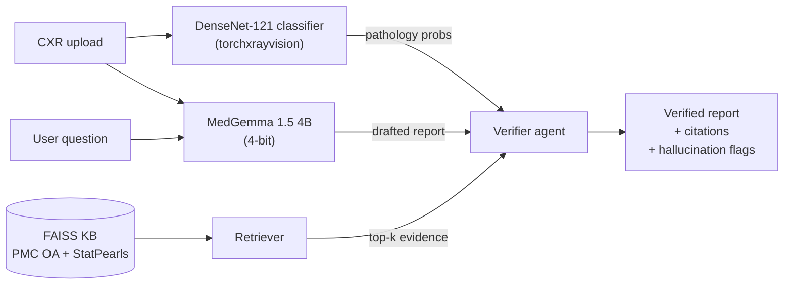

# Flagship A — CXR Copilot

Grounded, hallucination-guarding chest X-ray report assistant. Upload an X-ray + ask a question; get a report where every atomic claim is audited against an independent classifier signal *and* retrieved literature.

> **Research prototype. Not a medical device. Not for clinical decisions.**

## Architecture



## Why this isn't a clone of every "VLM + RAG for X-ray" demo

The **verifier agent** is the differentiator:

1. **Decomposes** the VLM's draft into atomic sentence-level claims.
2. **Detects** which pathology (if any) each claim asserts and whether it's negated.
3. **Cross-checks** each positive claim against two independent signals:
   - the classifier probability for that pathology, and
   - keyword coverage in the top-k retrieved passages.
4. **Flags** unsupported positive claims with `[UNVERIFIED]` and reports a **hallucination-rate delta** (before vs. after hedging) in the eval harness.

If you swap the VLM, the classifier, or the KB, the verifier's numbers move. That's the point.

## Layout

```
project_a_copilot/
├── app/
│   ├── classifier.py  # torchxrayvision DenseNet-121 wrapper
│   ├── rag.py         # FAISS build + FaissRetriever
│   ├── vlm.py         # MedGemma 1.5 4B (4-bit) + TemplateReporter fallback
│   ├── verifier.py    # split_claims + detect_label + verify()
│   ├── pipeline.py    # end-to-end glue
│   └── api.py         # FastAPI (/health, /predict)
├── frontend/streamlit_app.py
├── eval/run_eval.py   # CheXbert-F1 (fallback), retrieval hit@k, hallucination-rate delta
├── configs/copilot.yaml
└── README.md
```

## Quickstart

```bash
# 0. Prereqs: data + KB (from repo root)
python -m data.scripts.download_openi
python -m data.scripts.parse_openi_reports
python -m data.scripts.build_openi_splits
python -m data.scripts.build_rag_corpus

# 1. Build the FAISS index
python -m project_a_copilot.app.rag \
    --config project_a_copilot/configs/copilot.yaml --build

# 2. Sanity check the classifier
python -m project_a_copilot.app.classifier \
    --config project_a_copilot/configs/copilot.yaml \
    --image data/raw/openi/CXR1_1_IM-0001-3001.png

# 3. Serve
docker compose -f docker/docker-compose.yml up copilot   # FastAPI :8000, Streamlit :8501
# or ad-hoc:
uvicorn project_a_copilot.app.api:app --port 8000
streamlit run project_a_copilot/frontend/streamlit_app.py
```

## Eval

```bash
python -m project_a_copilot.eval.run_eval --config project_a_copilot/configs/copilot.yaml
```

Writes `artifacts/copilot_eval.json`:

| Field | Meaning |
|---|---|
| `chexbert_micro_f1` / `macro_f1` | Report-quality F1 across 14 CheXpert labels (keyword-fallback labeler; swap for the real CheXbert model when available). |
| `retrieval_hit@k` | Fraction of samples where at least one KB citation matches a reference-report keyword. |
| `hallucination_rate_before` | Fraction of positive labeled claims from the draft that lack independent support. |
| `hallucination_rate_after` | Effective rate after unsupported claims are transparently hedged with `[UNVERIFIED]`. |
| `delta` | `before − after` — the whole reason the verifier exists. |

## Results template (fill in after running)

| Regime | CheXbert micro-F1 | Retrieval hit@5 | Hallucination rate |
|---|---|---|---|
| VLM only (no verifier) | _fill_ | — | _fill_ |
| VLM + RAG (no verifier) | _fill_ | _fill_ | _fill_ |
| VLM + RAG + verifier | _fill_ | _fill_ | _fill_ (Δ _fill_) |

## Configuration

Everything is driven by [`configs/copilot.yaml`](configs/copilot.yaml). Notable knobs:
- `classifier.assertion_threshold` — probability above which the classifier "asserts" a finding.
- `verifier.classifier_support_threshold` — needed for a positive claim to be supported by the classifier alone.
- `verifier.min_kb_hits` — needed for a positive claim to be supported by RAG alone.
- `verifier.hedge_unsupported` — whether to rewrite unsupported claims as `[UNVERIFIED]`.
