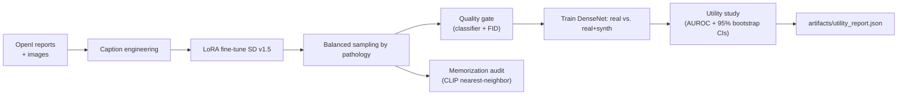
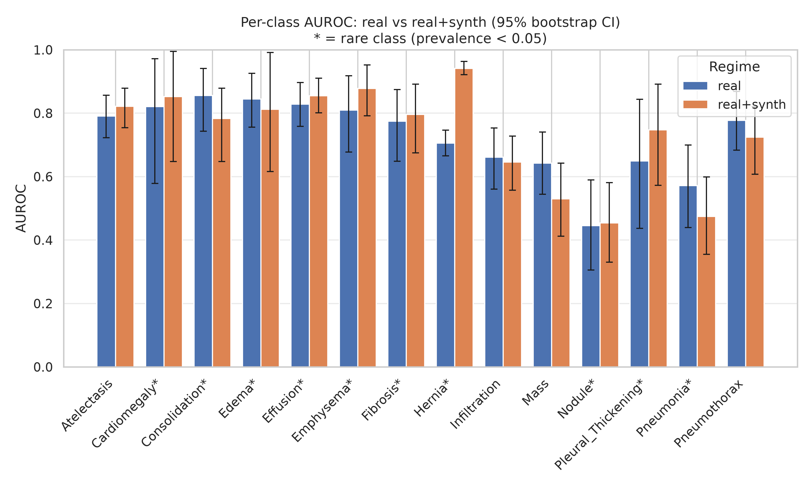
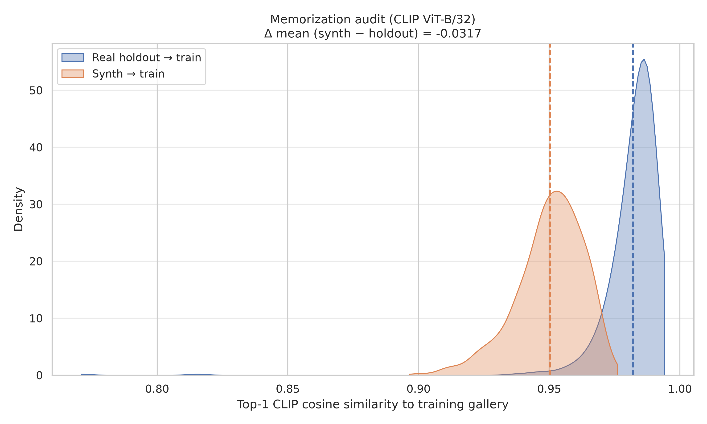

# Flagship B — Text-to-CXR Synthetic Data Engine

LoRA fine-tune Stable Diffusion v1.5 on OpenI chest X-ray reports, then **prove** the synthetic data lifts a downstream multi-label classifier — especially on rare pathologies. Ships with a memorization audit and a quality gate.

> **Research use only.** Generated images are synthetic and NOT valid for any clinical decision.

## Pipeline



## Results





### Utility table (NIH14 small subset, n_test=460)

| Regime | Macro AUROC (95% CI) | Rare-class Macro AUROC |
|---|---|---|
| Real only | 0.727 (0.689, 0.764) | 0.731 |
| Real + synth (filtered) | 0.737 (0.695, 0.772) | 0.760 |
| Lift | **+0.010** | **+0.029** |

Per-class chart above marks rare classes (prevalence &lt; 0.05) with `*`. Full JSON: [`../artifacts/utility_report.json`](../artifacts/utility_report.json) (also mirrored under `artifacts/reports/`).

### Memorisation audit

| Population | Mean | Median | P95 |
|---|---|---|---|
| Real holdout → train | 0.982 | 0.985 | 0.992 |
| Synth → train | 0.950 | 0.952 | 0.968 |
| Δ mean | **−0.032** (interpretation: if positive, potential memorisation) | | |

Quality gate kept **339 / 1800** generations at classifier threshold 0.4. FID was skipped on this torch/CUDA stack; the classifier filter still applied.

## Why this isn't a clone of "fine-tune SD on X-rays"

Three honest checks most demos skip:

1. **Utility, not vibes.** [`eval/utility_study.py`](eval/utility_study.py) trains two identical DenseNets on identical splits (real vs. real+synth) and reports per-class AUROC with 95% bootstrap CIs, plus a rare-class subset. If synth doesn't help, the JSON says so.
2. **Memorization audit.** [`scripts/memorization_audit.py`](scripts/memorization_audit.py) computes CLIP ViT-B/32 top-1 cosine similarity from synth → training set and from a real holdout → training set. A positive `delta_mean` is a memorization warning sign.
3. **Quality gate.** [`scripts/quality_gate.py`](scripts/quality_gate.py) drops synth samples where the pretrained classifier's probability for the intended pathology is below threshold, then measures FID before vs. after filtering.

## Layout

```
project_b_synth/
├── scripts/
│   ├── train_sd_lora.py            # PEFT LoRA on UNet Q/K/V/out, rank 16, fp16
│   ├── generate.py                 # pathology-balanced sampling
│   ├── quality_gate.py             # classifier filter + FID
│   ├── memorization_audit.py       # CLIP nearest-neighbor (+ sims.npz)
│   ├── train_downstream.py         # DenseNet-121 on NIH14 (real | real+synth)
│   ├── generate_results_plots.py   # portfolio figures from JSON reports
│   └── reproduce.sh                # end-to-end one-shot
├── eval/utility_study.py           # AUROC + bootstrap CIs, per-class + rare
├── demo/app.py                     # Gradio findings→CXR
├── configs/lora.yaml
└── README.md
```

## Quickstart

```bash
# 0. Prereqs (from repo root)
python -m data.scripts.download_openi
python -m data.scripts.parse_openi_reports
python -m data.scripts.build_openi_splits
python -m data.scripts.download_nih14 --subset small

# OpenI PNGs extract flat into data/raw/openi/ (not NLMCXR_png/).

# 1. Fine-tune (few hours on a 10–24GB GPU)
accelerate launch project_b_synth/scripts/train_sd_lora.py \
    --config project_b_synth/configs/lora.yaml

# 2. One-shot repro of the utility study
bash project_b_synth/scripts/reproduce.sh

# 3. Plots for the README
python project_b_synth/scripts/generate_results_plots.py

# 4. Demo
python -m project_b_synth.demo.app --lora checkpoints/sd_lora_openi/final/unet_lora
```

## Expected outputs

| File | What's in it |
|---|---|
| `artifacts/synth_images/` | Generated PNGs + `manifest.csv` + `kept.csv` |
| `artifacts/quality_report.json` | Kept/dropped counts per threshold + FID status |
| `artifacts/memorization.json` | Top-1 similarity stats for synth and holdout; `delta_mean` flag |
| `artifacts/memorization_sims.npz` | Raw top-1 similarity arrays for plotting |
| `artifacts/memorization_topk.csv` | Top-50 nearest-neighbor pairs |
| `artifacts/downstream/*.npz` | Per-regime test-set (`y_true`, `y_score`) |
| `artifacts/utility_report.json` | Macro + per-class AUROC with CIs, rare-class subset, lift |
| `artifacts/utility_comparison.png` | Grouped bar chart of per-class AUROC ± 95% CI |
| `artifacts/memorization_histogram.png` | KDE of synth vs holdout top-1 similarities |

## Configuration

See [`configs/lora.yaml`](configs/lora.yaml). Notable knobs:
- `lora.rank` / `alpha` — capacity vs. overfitting.
- `data.random_flip: false` — X-rays have handedness (heart on left); do NOT flip.
- `data.images_dir: data/raw/openi` — flat PNG extract path.
- `generate.guidance_scale` — higher = more faithful to text, less diverse.
- Quality gate `--threshold` — raise to be stricter, lower to keep more samples.
